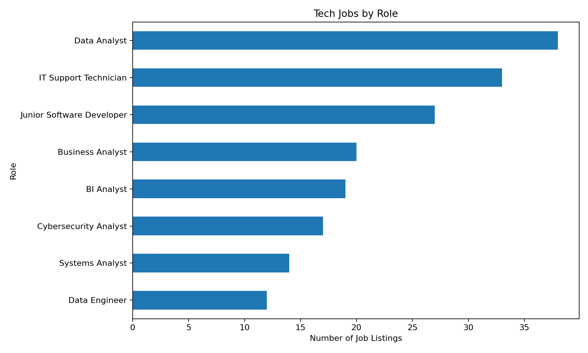
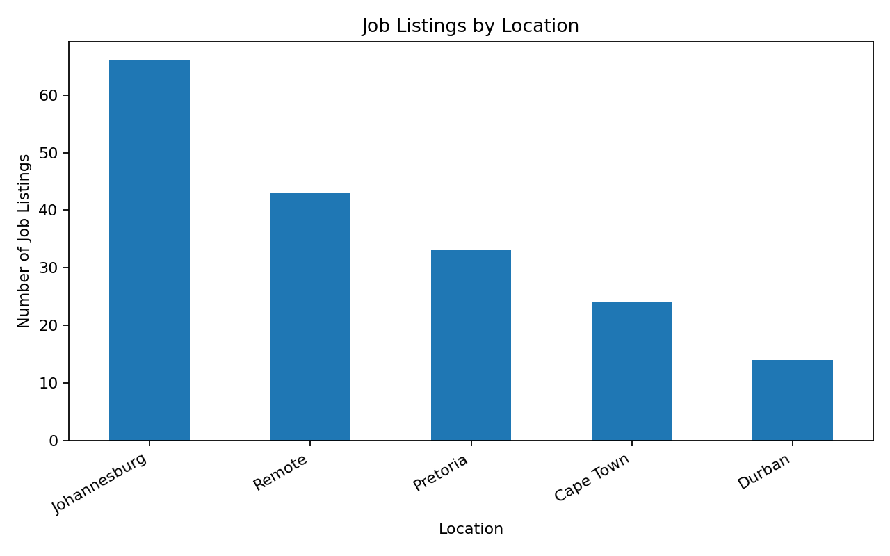

# South African Tech Job Market Analysis

## 📊 Project Overview

This is a personal data analytics portfolio project analysing a sample of technology job listings in South Africa.

The project explores job roles, salaries, locations, work arrangements, qualifications, experience levels and technical skills.

## 🎯 Project Objectives

The main objectives were to:

- Analyse technology job roles and demand
- Examine salary patterns
- Identify common job locations
- Analyse remote and hybrid opportunities
- Examine qualifications and experience requirements
- Practise SQL data analysis
- Create a dashboard concept using Power BI

## 🛠️ Tools Used

- Microsoft Excel
- SQL
- Power BI
- Data Analysis
- Data Visualisation

## 📁 Project Files

| File | Description |
|---|---|
| `South_African_Tech_Job_Market_Project.xlsx` | Excel analysis workbook |
| `South_African_Tech_Job_Market_Data.csv` | Dataset used for analysis |
| `tech_job_market_analysis.sql` | SQL queries used for analysis |

## 🔍 Business Questions

This project investigates questions such as:

1. Which technology roles appear most frequently?
2. What are the average salaries by role?
3. Which locations contain the most opportunities?
4. How common are remote and hybrid jobs?
5. What qualifications are commonly requested?
6. What experience levels are associated with different roles?

## 📈 Dashboard

The planned Power BI dashboard contains:

- Total job listings
- Remote job opportunities
- Average monthly salary
- Jobs by technology role
- Salary by role
- Jobs by location
- Work arrangement
- Experience and qualification analysis

## 💡 Skills Demonstrated

This project demonstrates practical skills in:

- Data cleaning
- Data organisation
- Excel analysis
- SQL querying
- Data visualisation
- Dashboard planning
- Business-question development
- Communicating data insights

## ⚠️ Dataset Note

The dataset used in this portfolio project is **synthetic** and was created for learning and demonstration purposes. It should not be interpreted as current South African labour-market statistics.

## 👤 Author

**Wayne98469**

Data Analytics Portfolio Project — 2026
## 📊 Dashboard Visualizations

### 1. Technology Role Demand

### 2. Salary by Role

### 3. Job Locations

### 4. Work Arrangement

